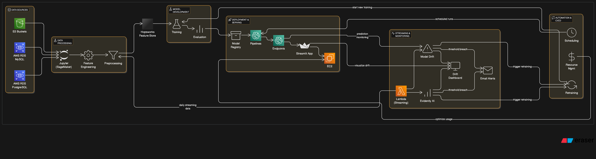

# 🚚 Truck Delay Classification - End-to-End ML Pipeline

[](https://www.python.org/downloads/release/python-3100/)
[](https://aws.amazon.com/sagemaker/)
[](https://www.hopsworks.ai/)
[](https://www.docker.com/)
[](https://opensource.org/licenses/MIT)
[](https://projectpro.io/)

## 📋 Overview

This project addresses a critical challenge faced by the logistics industry: **delayed truck shipments**. These delays not only increase operational costs but also significantly impact customer satisfaction. Timely delivery is essential for maintaining competitiveness in the logistics sector.

### 🎯 Business Impact

By accurately predicting truck delays, logistics companies can:

- ✅ **Improve operational efficiency** by allocating resources more effectively
- ✅ **Enhance customer satisfaction** by providing more reliable delivery schedules
- ✅ **Optimize route planning** to reduce delays caused by traffic or adverse weather conditions
- ✅ **Reduce costs** associated with delayed shipments, such as penalties or compensation to customers

## 🔄 Project Series

### Previous Parts:

1. **Part 1**: Laid the groundwork by: [Truck_Delay_Classification_Part_1]

   - Utilizing PostgreSQL and MySQL in AWS RDS for data storage
   - Setting up AWS SageMaker Notebook environments
   - Performing data retrieval and exploratory data analysis
   - Creating feature groups with Hopsworks
2. **Part 2**: Focused on building the ML pipeline by:[Truck-Delay-Classification_Part_2]

   - Retrieving data from the feature store
   - Performing train-validation-test split
   - Implementing one-hot encoding and scaling numerical features
   - Experimenting with logistic regression, random forest, and XGBoost models
   - Deploying a Streamlit application on AWS

### Current Part:

Building upon the previous work, Part 3 implements:

- 📊 **Model monitoring** to detect data and model drift
- 🔄 **CI/CD practices** for automated model deployment
- 🧩 **Amazon SageMaker Pipelines** for streamlined orchestration of the ML workflow

The aim is to ensure the reliability, scalability, and efficiency of the deployed model in real-world logistics scenarios.

## 🛠️ Technical Approach

<p align="center">
  
</p>

### Streaming Data & Model Monitoring

1. **Setting up Streaming Data Generation**:

   - Define functions to generate streaming data mimicking real-world scenarios
   - Ensure data is representative and diverse to capture various conditions
2. **Lambda Function Creation for Streaming Data**:

   - Write Lambda functions to handle incoming streaming data
   - Configure necessary permissions and triggers
   - Develop logic to process and transform streaming data
   - Integrate Lambda functions into the pipeline architecture
3. **Docker Image Creation with Python 3.10**:

   - Build a Docker image containing the required Python environment and dependencies
4. **Data & Model Drift Calculation**:

   - Implement algorithms to calculate drift based on historical and real-time data
   - Monitor deviations in data and model performance for proactive intervention
5. **Model Retraining and Evaluation**:

   - Develop processes for retraining models based on detected drift and updated data
6. **SageMaker Pipeline Automation**:

   - Configure scheduling mechanisms to automate pipeline execution
   - Set up notification systems for pipeline status and events
7. **Resource Optimization**:

   - Ensure efficient resource management and cost optimization

## 📂 Project Structure

```
E2E-3 Codes
├─ Lambda_function_streaming_data
│  ├─ lambda_layers
│  │  ├─ pymysql_layer.zip
│  │  └─ sqlalchemy_psycopg2_layer.zip
│  └─ lambda_streaming_data_gen.py
├─ Python3.10_docker
│  └─ Dockerfile
├─ README.md
├─ sagemaker_pipeline_notifications_cdk
│  └─ python
│     ├─ app.py
│     ├─ cdk.json
│     ├─ Dockerfile
│     ├─ example-workflow.json
│     ├─ lambda_function.py
│     ├─ requirements.txt
│     ├─ resources
│     │  ├─ sample-event.json
│     │  └─ statemachine.png
│     └─ source.bat
├─ StreamingData_Sagemaker_Pipeline
│  ├─ calculate_data_drift.py
│  ├─ calculate_model_drift.py
│  ├─ feature_engg_finalmerge_hopsworks.py
│  ├─ fetch_streaming_dump_to_hopsworks.py
│  ├─ is_first_day_of_week.py
│  ├─ model_drift_not_detected.py
│  ├─ model_retraining.py
│  ├─ not_first_day_of_week.py
│  ├─ pipeline-structure.png
│  ├─ pipeline.py
│  ├─ previous_data_updation.py
│  ├─ sagemaker-pipelines-project.ipynb
│  └─ test.py
├─ Streaming_data
│  ├─ streaming_city_weather.csv
│  ├─ streaming_route_weather.csv
│  ├─ streaming_schedule.csv
│  └─ streaming_traffic.csv
└─ Training_Codes
   ├─ app.py
   ├─ config.yaml
   ├─ data
   │  ├─ Database_backup
   │  │  ├─ truck-eta-mysql.sql
   │  │  └─ truck-eta-postgres.sql
   │  ├─ data_description.pdf
   │  └─ Training_data
   │     ├─ city_weather.csv
   │     ├─ drivers_table.csv
   │     ├─ routes_table.csv
   │     ├─ routes_weather.csv
   │     ├─ traffic_table.csv
   │     ├─ trucks_table.csv
   │     └─ truck_schedule_table.csv
   ├─ engine.py
   ├─ logs
   │  ├─ truck_eta_error_logs.log
   │  └─ truck_eta_info_logs.log
   ├─ ml_pipeline
   │  ├─ data_prep.py
   │  ├─ evaluate.py
   │  ├─ modelling.py
   │  ├─ process.py
   │  └─ utils.py
   ├─ models
   │  ├─ log-truck-model.pkl
   │  ├─ randomf-truck-model.pkl
   │  └─ xgb-truck-model.pkl
   ├─ notebooks
   │  ├─ Truck-Delay-Classification_Part_2.ipynb
   │  └─ Truck_Delay_Classification_Part_1.ipynb
   ├─ output
   │  ├─ truck_data_encoder.pkl
   │  └─ truck_data_scaler.pkl
   ├─ requirements.txt
   └─ sample-monitoring_pipeline.ipynb
```

## 📚 Component Description

<details>
<summary><b>🔍 Click to expand component details</b></summary>

### 🔹 Lambda Function for Streaming Data

Contains lambda functions and required layers for streaming data processing:

- `lambda_streaming_data_gen.py`: Main Lambda function for generating and processing streaming data
- Lambda layers with required dependencies (pymysql, sqlalchemy, psycopg2)

### 🔹 Docker Setup

Provides a Dockerfile for setting up a Python 3.10 environment in the `Python3.10_docker` directory.

### 🔹 SageMaker Pipeline Notifications CDK

Includes scripts and configurations for SageMaker pipeline notifications using AWS CDK:

- `app.py`: Main CDK application
- `lambda_function.py`: Lambda function for notifications
- `cdk.json`: CDK configuration
- Various resources including state machine visualization

### 🔹 Streaming Data SageMaker Pipeline

Contains scripts and notebooks for the streaming data pipeline:

- Data drift and model drift calculation scripts
- Feature engineering and Hopsworks integration
- Pipeline definition and orchestration
- Jupyter notebooks for pipeline development and testing

### 🔹 Training Codes

Includes all necessary scripts and data for model training:

- Training data and database backups
- ML pipeline components (data preparation, evaluation, modeling)
- Trained models (logistic regression, random forest, XGBoost)
- Analysis notebooks from previous parts of the project

</details>

## 🚀 Getting Started

### Prerequisites

- Python 3.10
- AWS account with appropriate permissions
- Docker (for containerized deployments)
- Git

### Installation

#### Setting up Python 3.10 Environment

<details>
<summary><b>📋 Windows Instructions</b></summary>

1. Open Command Prompt (Win + R, type "cmd", press Enter)
2. Navigate to your project directory:
   ```
   cd C:\path\to\project
   ```
3. Create a virtual environment:
   ```
   python -m venv myenv
   ```
4. Activate the environment:
   ```
   myenv\Scripts\activate
   ```
5. Install requirements:
   ```
   pip install -r requirements.txt
   ```

</details>

<details>
<summary><b>📋 Linux/Mac Instructions</b></summary>

1. Open terminal
2. Navigate to your project directory:
   ```
   cd /path/to/project
   ```
3. Create a virtual environment:
   ```
   python3.10 -m venv myenv
   ```
4. Activate the environment:
   ```
   source myenv/bin/activate
   ```
5. Install requirements:
   ```
   pip install -r requirements.txt
   ```

</details>

<details>
<summary><b>📋 Multiple Python Versions</b></summary>

#### For Windows:

1. Open Command Prompt
2. Navigate to your project directory:
   ```
   cd C:\path\to\project
   ```
3. Create a virtual environment with Python 3.10:
   ```
   py -3.10 -m venv myenv
   ```
4. Activate the environment:
   ```
   myenv\Scripts\activate
   ```
5. Install requirements:
   ```
   pip install -r requirements.txt
   ```

#### For Linux/Mac:

1. Open terminal
2. Navigate to your project directory:
   ```
   cd /path/to/project
   ```
3. Create a virtual environment with Python 3.10:
   ```
   python3.10 -m venv myenv
   ```
4. Activate the environment:
   ```
   source myenv/bin/activate
   ```
5. Install requirements:
   ```
   pip install -r requirements.txt
   ```

</details>

## 💻 Usage

### Running the Streamlit Application

```bash
streamlit run app.py
```

### Running the SageMaker Pipeline

```python
import boto3
import sagemaker
from sagemaker.workflow.pipeline import Pipeline

# Set up SageMaker session
sagemaker_session = sagemaker.Session()
role = sagemaker.get_execution_role()

# Import the pipeline definition
from pipeline import get_pipeline

# Create the pipeline
pipeline = get_pipeline(
    region=sagemaker_session.boto_region_name,
    role=role,
    default_bucket=sagemaker_session.default_bucket(),
)

# Submit the pipeline definition to SageMaker
pipeline.upsert(role_arn=role)

# Start the pipeline execution
execution = pipeline.start()
```

### Monitoring Data Drift

```python
from calculate_data_drift import calculate_drift

# Calculate drift between historical and current data
drift_metrics = calculate_drift(
    historical_data_path="s3://bucket/historical_data.csv",
    current_data_path="s3://bucket/current_data.csv",
    threshold=0.05
)

print(f"Data drift detected: {drift_metrics['drift_detected']}")
print(f"Drift score: {drift_metrics['drift_score']}")
```

## 🌐 Streamlit Application Deployment on AWS EC2

<details>
<summary><b>📍 Click to expand deployment instructions</b></summary>

### Prerequisites

- AWS Account
- Basic knowledge of AWS EC2, SSH, and Streamlit

## Deployment Steps

### 1. Launching EC2 Instance

- Launch an EC2 instance on AWS with the following specifications:

  - Ubuntu 22.04 LTS
  - Instance Type: t2.medium (or your preferred type)
  - Security Group: Allow inbound traffic on port 8501 for Streamlit
- Create and download a PEM key for SSH access to the EC2 instance.
- Disable Inheritance and Restrict Access on PEM key For Windows Users:

  - Locate the downloaded PEM key file (e.g., your-key.pem) using File Explorer.
  - Right-click on the PEM key file and select "Properties."
  - In the "Properties" window, go to the "Security" tab.
  - Click on the "Advanced" button.
  - In the "Advanced Security Settings" window, you'll see an "Inheritance" section. Click on the "Disable inheritance" button.
  - A dialog box will appear; choose the option "Remove all inherited permissions from this object" and click "Convert inherited permissions into explicit permissions on this object."
  - Once inheritance is disabled, you will see a list of users/groups with permissions. Remove permissions for all users except for the user account you are using (typically an administrator account).
  - Click "Apply" and then "OK" to save the changes.

### 2. Accessing EC2 Instance

1. Use the following SSH command to connect to your EC2 instance:

```
  ssh -i "your-key.pem" ubuntu@your-ec2-instance-public-ip
```

2. Gain superuser access by running: `sudo su`
3. Updating and Verifying Python

- Update the EC2 instance with the latest packages:
  `apt update`
- Verify Python installation:
  `python3 --version`

4. Installing Python Packages
   `apt install python3-pip`
5. Transferring Files to EC2
   Use SCP to transfer your Streamlit application code to the EC2 instance:

   ``scp -i "your-key.pem" -r path/to/your/app ubuntu@your-ec2-instance-public-ip:/path/to/remote/location``
6. Setting Up Streamlit Application
   Change the working directory to the deployment files location:

   `cd /path/to/remote/location`

   Install dependencies from your requirements file:

   `pip3 install -r requirements.txt`
7. Running the Streamlit Application
   Test your Streamlit application (Use external link):
   `streamlit run app.py`

   For a permanent run, use nohup:
   `nohup streamlit run app.py`
8. Cleanup and Termination
   To terminate the nohup process:

- `sudo su`
- `ps -df`
- `kill {process id}`

</details>

## 🔧 Configuration

<details>
<summary><b>📍 Database Configuration</b></summary>

### Constants Table Setup

```sql
CREATE TABLE constants(
    id INT, 
    routes_weather BIGINT,
    truck_schedule_data BIGINT,
    traffic_details BIGINT,
    city_weather BIGINT,
    is_first_day_of_new_week BOOLEAN,
    week_start_date DATE,
    day DATE,
    weekly_streaming BIGINT
);

-- Insert initial data
INSERT INTO constants VALUES(
    1, 425712, 12308, 2597913, 55176, 
    False, '2019-02-15', '2019-02-15', 1
);
```

</details>

<details>
<summary><b>📍 YAML Configuration Example</b></summary>

```yaml
# config.yaml
aws:
  region: us-east-1
  s3_bucket: truck-delay-classification

database:
  postgres:
    host: your-postgres-host.rds.amazonaws.com
    port: 5432
    database: truck_eta
  mysql:
    host: your-mysql-host.rds.amazonaws.com
    port: 3306
    database: truck_eta

hopsworks:
  project_name: truck_delay_classification
  feature_group: truck_features

model:
  type: xgboost
  hyperparameters:
    max_depth: 6
    eta: 0.3
    objective: binary:logistic
```

</details>

## 🤝 Contributing

Contributions are welcome! Please feel free to submit a Pull Request.

1. Fork the repository
2. Create your feature branch (`git checkout -b feature/amazing-feature`)
3. Commit your changes (`git commit -m 'Add some amazing feature'`)
4. Push to the branch (`git push origin feature/amazing-feature`)
5. Open a Pull Request

## 📄 License

This project is licensed under the MIT License - see the LICENSE file for details.

## 📞 Contact

Project Link: [kasi.majji24@gmail.com](https://github.com/username/Truck-Delay-Classification)

---

<p align="center">
  
  
  
</p>

## 🎓 Credits

This project was developed as part of a guided project from [ProjectPro](https://www.projectpro.io/), a platform that provides hands-on data science and big data projects for learning and skill development.
